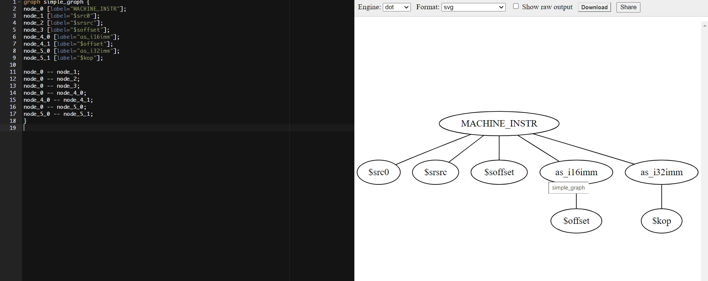

# Introduction
This project gets inspired by [this](https://stackoverflow.com/questions/8877767/graphically-plotting-lisp-code) stackoverflow ticket. When I tried to explain the DAG of instruction selection pattern in LLVM, it's not intuitive if we just look at the TD code. So, I decide to make a way to draw a picture from the DAG string. It's it

# Preparation
You must install racket first to run it. See: https://download.racket-lang.org/

# Usage
Please note that we must use \' not \" in the command line to encapsulate the DAG string, using \" will cause the command line to replace all fields started with $ to environment variables.
```
# correct, using \' to encapsulate the DAG string
./main.rkt '(MACHINE_INSTR $src0, $srsrc, $soffset, (as_i16imm $offset), (as_i32imm $kop))'

# do not use \" like the following command
./main.rkt "(MACHINE_INSTR $src0, $srsrc, $soffset, (as_i16imm $offset), (as_i32imm $kop))"
```

The first command will print a graph like this, you can paste it to an online Graphviz website to get a visible graph. https://dreampuf.github.io/GraphvizOnline/ 
```
graph simple_graph {
node_0 [label="MACHINE_INSTR"];
node_1 [label="$src0"];
node_2 [label="$srsrc"];
node_3 [label="$soffset"];
node_4_0 [label="as_i16imm"];
node_4_1 [label="$offset"];
node_5_0 [label="as_i32imm"];
node_5_1 [label="$kop"];

node_0 -- node_1;
node_0 -- node_2;
node_0 -- node_3;
node_0 -- node_4_0;
node_4_0 -- node_4_1;
node_0 -- node_5_0;
node_5_0 -- node_5_1;
}
```

# Screenshot

